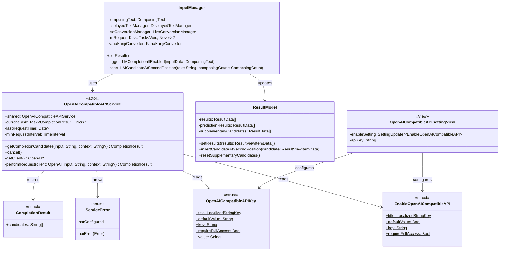

# LLMタイプミス自動修正機能 設計書

## 概要

Issue: [#679](https://github.com/azooKey/azooKey/issues/679)

iPhoneの狭い画面で隣のキーを誤押下した場合のタイプミスを、LLM（GPT-5など）を使って自動修正する機能を実装する。

### 背景

azooKey 3.0.2では、タイプミスに対する自動修正機能がない。例えば「ryoukaishimadhita」（了解しましたのタイプミス）を入力すると、「了解しまでぃた」など不適切な変換候補しか提示されない。iOS標準キーボードと異なり、この問題を解決する機能が必要。

### 目標

- OpenAI互換APIを利用してタイプミスを検出・修正
- キーボード操作をブロックせずに非同期でAPI呼び出し
- 従量課金を考慮し、過度なAPI呼び出しを避ける

## アーキテクチャ

### 採用パターン: Actor型スレッドセーフパターン

Swift Concurrencyの`actor`を使用したスレッドセーフな実装を採用する。

#### 選定理由

1. **並行アクセスの安全性**: キーボード入力中に複数のAPIリクエストが発生する可能性があり、actorにより自動的に直列化される
2. **非同期処理との親和性**: `Task { ... }`でラップしてキーボード操作と並行実行
3. **組み込み済み機能**: レート制限対策、タスクキャンセル、タイムアウトが標準で含まれる
4. **リソース効率**: シングルトンパターンによりキーボード拡張のメモリ制限下でも効率的

### 使用ライブラリ

[MacPaw/OpenAI](https://github.com/MacPaw/OpenAI)を使用してHTTPリクエスト処理を簡潔に実装する。

## クラス図



## コンポーネント設計

### 1. 設定キー (AzooKeyCore/Sources/AzooKeyUtils)

#### OpenAICompatibleAPISettingKeys.swift

```swift
import Foundation
import SwiftUI

/// OpenAI Compatible API のAPIキー設定
public struct OpenAICompatibleAPIKey: KeyboardSettingKey, StoredInUserDefault {
    public static let title: LocalizedStringKey = "APIキー"
    public static let explanation: LocalizedStringKey = "OpenAI互換APIを利用するためのAPIキーを設定します。"
    public static let defaultValue: String = ""
    public static let key: String = "openai_compatible_api_key"
    public static let requireFullAccess: Bool = true

    @MainActor public static var value: String {
        get { SharedStore.userDefaults.string(forKey: key) ?? defaultValue }
        set { SharedStore.userDefaults.set(newValue, forKey: key) }
    }
}

public extension KeyboardSettingKey where Self == OpenAICompatibleAPIKey {
    static var openAICompatibleAPIKey: Self { .init() }
}

/// OpenAI Compatible API機能の有効/無効
public struct EnableOpenAICompatibleAPI: BoolKeyboardSettingKey {
    public static let title: LocalizedStringKey = "OpenAI互換API機能を有効化"
    public static let explanation: LocalizedStringKey = "OpenAI互換APIを利用した変換候補を表示します。"
    public static let defaultValue = false
    public static let key: String = "enable_openai_compatible_api"
    public static let requireFullAccess: Bool = true
}

public extension KeyboardSettingKey where Self == EnableOpenAICompatibleAPI {
    static var enableOpenAICompatibleAPI: Self { .init() }
}
```

### 2. OpenAICompatibleAPIService (Keyboard/Display)

#### OpenAICompatibleAPIService.swift

```swift
import AzooKeyUtils
import Foundation
import OpenAI

/// OpenAI互換APIへのアクセスを管理するActor
actor OpenAICompatibleAPIService {

    // MARK: - Types

    struct CompletionResult: Sendable {
        let candidates: [String]
    }

    enum ServiceError: Error, Sendable {
        case notConfigured
        case apiError(Error)
    }

    // MARK: - Singleton

    static let shared = OpenAICompatibleAPIService()

    // MARK: - Properties

    private var currentTask: Task<CompletionResult, Error>?
    private var lastRequestTime: Date?
    private let minRequestInterval: TimeInterval = 0.3

    // MARK: - Configuration

    @MainActor
    private func getClient() -> OpenAI? {
        @KeyboardSetting(.openAICompatibleAPIKey) var apiKey
        @KeyboardSetting(.enableOpenAICompatibleAPI) var enabled
        guard enabled, !apiKey.isEmpty else { return nil }
        return OpenAI(apiToken: apiKey)
    }

    // MARK: - Public Methods

    func getCompletionCandidates(for input: String, context: String? = nil) async throws -> CompletionResult {
        guard let client = await getClient() else {
            throw ServiceError.notConfigured
        }

        // レート制限チェック
        if let lastTime = lastRequestTime {
            let elapsed = Date().timeIntervalSince(lastTime)
            if elapsed < minRequestInterval {
                try await Task.sleep(nanoseconds: UInt64((minRequestInterval - elapsed) * 1_000_000_000))
            }
        }

        currentTask?.cancel()

        let task = Task {
            try await performRequest(client: client, input: input, context: context)
        }
        currentTask = task
        lastRequestTime = Date()

        return try await task.value
    }

    func cancel() {
        currentTask?.cancel()
        currentTask = nil
    }

    // MARK: - Private

    private func performRequest(client: OpenAI, input: String, context: String?) async throws -> CompletionResult {
        let instructions = "あなたは日本語入力の変換候補を提案するアシスタントです。"
        let userPrompt = context != nil
            ? "文脈: \(context!)\n入力: \(input)\n最も適切な変換候補を3つ、改行区切りで出力してください。"
            : "入力: \(input)\n最も適切な変換候補を3つ、改行区切りで出力してください。"

        do {
            // Responses API を使用
            let query = ResponseQuery(
                model: .gpt5,
                input: .text(userPrompt),
                instructions: instructions,
                maxOutputTokens: 100
            )

            let response = try await client.responses.create(query: query)

            // レスポンスからテキストを抽出
            let text = response.output?
                .first(where: { $0.type == "message" })?
                .content?
                .first(where: { $0.type == "output_text" })?
                .text ?? ""

            let candidates = text.components(separatedBy: .newlines)
                .map { $0.trimmingCharacters(in: .whitespaces) }
                .filter { !$0.isEmpty }

            return CompletionResult(candidates: candidates)
        } catch {
            throw ServiceError.apiError(error)
        }
    }
}
```

### 3. InputManagerへの統合

#### InputManager.swift での呼び出し例

```swift
// API呼び出し用のタスクを保持
private var llmRequestTask: Task<Void, Never>?

@MainActor func setResult() {
    // 既存の変換処理（同期的に即座に完了）
    let results = self.kanaKanjiConverter.requestCandidates(inputData, options: options)

    // 前回のLLMリクエストタスクをキャンセル
    llmRequestTask?.cancel()

    // 約1秒の遅延後にAPI呼び出し（キーボード操作があればキャンセルされる）
    let currentInputData = inputData
    llmRequestTask = Task {
        do {
            // 1秒待機（この間に新しい入力があればキャンセルされる）
            try await Task.sleep(nanoseconds: 1_000_000_000)

            // キャンセルされていなければAPI呼び出し
            let aiResults = try await OpenAICompatibleAPIService.shared.getCompletionCandidates(
                for: currentInputData.convertTarget
            )
            // 結果が返ってきたら候補の2番目に挿入
            await MainActor.run {
                self.insertAICandidateAtSecondPosition(aiResults.candidates.first)
            }
        } catch {
            // キャンセルまたはエラーは無視（ユーザー体験を損なわない）
        }
    }
}
```

## 処理フロー

```
ユーザー入力（例: "ryoukaishimadhita"）
    ↓
InputManager.setResult() が呼ばれる
    ↓
┌─────────────────────────────────────────┐
│ 同期処理                                 │
│ kanaKanjiConverter.requestCandidates()   │
│ → 既存の変換候補を即座に表示              │
│ → 前回のLLMリクエストタスクをキャンセル    │
└─────────────────────────────────────────┘
    ↓
ユーザーは即座にキーボード操作を継続可能
    ↓
┌─────────────────────────────────────────┐
│ 1秒間キーボード操作なし？                 │
├─────────────────────────────────────────┤
│ YES → LLM API呼び出しを実行              │
│ NO  → タスクがキャンセルされ何もしない    │
└─────────────────────────────────────────┘
    ↓ (YESの場合)
┌─────────────────────────────────────────┐
│ 非同期処理                               │
│ OpenAICompatibleAPIService               │
│   .shared.getCompletionCandidates()      │
│ → API応答後、候補リストの2番目に挿入     │
└─────────────────────────────────────────┘
    ↓
変換候補バーの2番目にLLM候補が表示される
```

### LLM候補の挿入位置

LLMで得られた変換候補は、**変換候補リストの2番目**に挿入する。

**理由:**
- 1番目（先頭）は既存のかな漢字変換エンジンが提案する最も確度の高い候補を維持
- 2番目に挿入することで、ユーザーがLLM候補を容易に選択可能
- ライブ変換では1番目の候補が自動適用されるため、LLM候補が意図せず確定されることを防ぐ

**表示例:**
```
変換候補バー: [既存候補1] [LLM候補] [既存候補2] [既存候補3] ...
```

## 設定画面 (MainApp)

### OpenAI互換API設定画面の追加

- APIキー入力フィールド（SecureField）
- 機能有効/無効トグル
- フルアクセスが必要である旨の説明

## パッケージ依存関係

### AzooKeyCore/Package.swift への追加

```swift
dependencies: [
    // 既存の依存関係...
    .package(url: "https://github.com/MacPaw/OpenAI.git", from: "0.4.6")
],
targets: [
    .target(
        name: "AzooKeyUtils",
        dependencies: [
            // 既存の依存関係...
            .product(name: "OpenAI", package: "OpenAI")
        ]
    )
]
```

## セキュリティ考慮事項

1. **APIキーの保存**: UserDefaultsに保存（App Groups経由でキーボード拡張と共有）
2. **フルアクセス必須**: ネットワークアクセスにはフルアクセス権限が必要
3. **キーの暗号化**: 将来的にKeychainへの移行を検討

## リファクタリングなどのTODO

1. LLM候補の色の定義をAzooKeyTheme型に定義する。
2. LLM候補の色の調整を行う。以下のようなコードに沿う。
```
        // ポインテッド時の色を定義
        var color: Color {
            switch (colorScheme, theme) {
            case (.dark, defaultTheme):
                .systemGray4
            case (.dark, nativeTheme):
                .systemGray3
            default:
                .white
            }
        }
```
3. OpenAI互換APIの設定画面の説明の文章を相談
4. OpenAI互換APIによるタイプミス修正の説明を、「フルアクセスについて」のページに記載するかどうか

## 制約事項

1. **ネットワーク依存**: オフライン時は機能しない
2. **レイテンシ**: API応答まで約1秒の遅延がある
3. **コスト**: OpenAI互換APIは従量課金のため、過度な使用に注意
4. **バイナリサイズ**: MacPaw/OpenAIライブラリ追加による増加

## 今後の拡張

1. **他のLLMプロバイダー対応**: Anthropic Claude、Google Geminiなど
2. **ローカルLLM対応**: オンデバイス推論による遅延・コスト削減
3. **キャッシング**: 同一入力に対する結果のキャッシュ
4. **学習機能**: ユーザーの選択傾向を学習

## azooKeyのタイプミスの結果 とGPT-5.1での修正結果の記録

普段使いで実際にあったタイプミスと本対応での修正案の提示内容の例

- azooKeyの設定
  - バージョン: 3.0.2
  - Zenzai: 有効化
  - ライブ変換: ON
  - 入力方式: QWERTY

| 入力したローマ字 | azooKeyの第一候補 | GPT-5.1が提示した候補 |
|------------------|-------------------|-----------------------|
| kanselshimazu    | カンセル島ず      | キャンセルします      |
| sousimazu        | 創始まず          | そうします            |
| roukaidesu       | ろうかいです      | 了解です              |
| okdesu           | おkです           | OKです                |
| daijyobudesu     | だいじょぶです    | 大丈夫です            |

## 参考リンク

- [MacPaw/OpenAI - GitHub](https://github.com/MacPaw/OpenAI)
- [OpenAI API Documentation](https://platform.openai.com/docs/)
- [OpenAI Responses vs Chat Completions](https://platform.openai.com/docs/guides/responses-vs-chat-completions)
